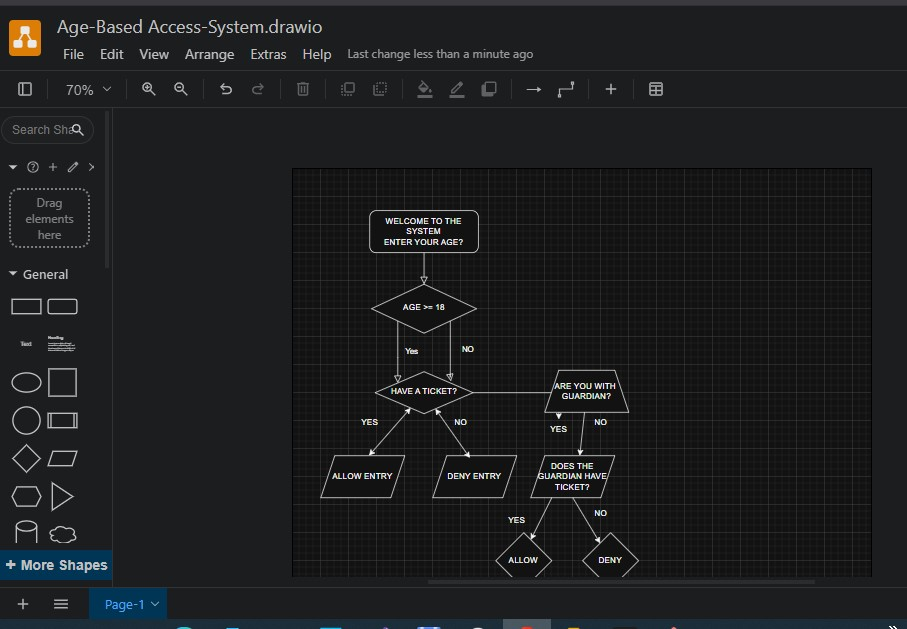

# 🎉 Age-Based Party 🎉

This is a beginner-friendly Python project that simulates a party entry system based on the user's age, guardian status, and ticket confirmation. Built during my 100 Days of Python journey, it uses fundamental Python concepts along with creative ASCII art to enhance the console experience.

---

## 🚀 What It Does
- Asks the user for their age.
- If under 18, it checks if the user is accompanied by a guardian.
- Verifies ticket purchase before allowing entry.
- Responds with customized messages based on user input.

---

## 🧠 Topics Practiced
- `if`, `elif`, `else` control flow
- Comparison operators and logical operators
- Nested if-statements
- User input and type conversion
- ASCII Art styling in console
- Flowchart-based thinking and design

---

## 💡 Sample Output

🎉 Welcome to the Age-Based Party 🎉
Enter your age please:
16
Are you with guardian (yes/no)
yes
Do you want to buy a ticket? (yes/no)
yes
You have bought a ticket. You and your Guardian enjoy the party.


---

## 🧭 Flowchart Design

Below is the flowchart that shows the logic behind the program:



---

## 📦 How to Run

Make sure you have Python installed, then run the following command:

```bash
python app.py


Built by [Abdurahman] as part of my #100DaysOfCode journey.

Connect with me on GitHub: https://github.com/Kacabdev

